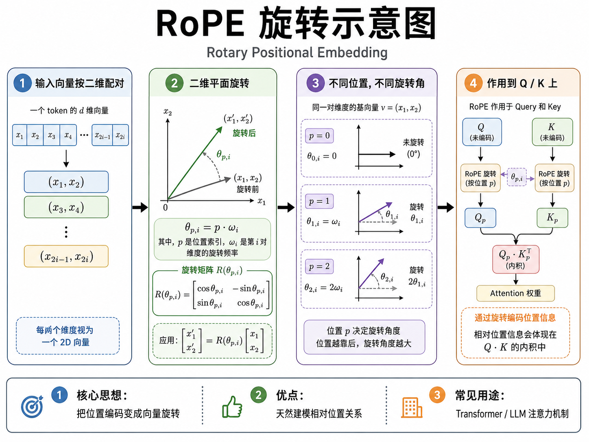

# 03_Transformer与Attention

---

## 一、Transformer 整体结构

### Q: 画出 Transformer 的结构图，并解释每个组件的功能。⭐⭐⭐⭐⭐


Transformer 由 Encoder 和 Decoder 两部分组成（但现在 LLM 只用 Decoder 部分）。核心组件：

1. **Input Embedding**：将 token ID 映射为向量
2. **Positional Encoding**：注入位置信息（RoPE、ALiBi）
3. **Multi-Head Self-Attention**：让每个 token 关注序列中的其他 token
4. **Feed-Forward Network (FFN)**：对每个位置独立做非线性变换（SwiGLU）
5. **Residual Connection + LayerNorm/RMSNorm**：稳定训练
6. **LM Head**：将 hidden state 映射回 vocab space，输出 logits

**3 分钟版本**：在以上基础上展开每个组件的作用，特别是 causal mask 和 why decoder-only。

在项目中：
- MiniMind 从零实现了标准 Transformer（transformer.py），包括 MultiHeadAttention、PositionalEncoding、FFN 等
- MiniMind 中使用了 RMSNorm、RoPE、GQA（MiniMind2）、SwiGLU

---

## 二、Encoder-only / Decoder-only / Encoder-Decoder 区别

### Q: Bert 和 GPT 的架构区别是什么？为什么现在大模型都用 decoder-only？⭐⭐⭐⭐

| 架构 | 代表模型 | Attention 类型 | 适用场景 |
|------|---------|---------------|---------|
| Encoder-only | BERT | Bidirectional self-attention | 理解任务（分类、NER） |
| Decoder-only | GPT, Llama, Qwen | Causal self-attention | 生成任务、对话 |
| Encoder-Decoder | T5, BART | Bidirectional encoder + Causal decoder | 翻译、摘要 |

Decoder-only 成为主流的原因：
1. 统一范式：所有 NLP 任务都可以用"文本 in -> 文本 out"
2. Causal attention + teacher forcing 让训练非常高效
3. Scaling law 已验证 decoder-only 在更大规模下效果持续提升

---

## 三、Self-Attention / Multi-Head Attention

### Q: 详细推导 Self-Attention 的计算过程，包括维度。⭐⭐⭐⭐⭐

**核心公式**：

$$\text{Attention}(Q, K, V) = \text{softmax}\left(\frac{QK^T}{\sqrt{d_k}}\right)V$$

**逐步推导（假设输入 $X \in \mathbb{R}^{n \times d}$，$n$ 是序列长度，$d$ 是模型维度）：**

1. **线性变换**：通过三个权重矩阵生成 Q、K、V
   $$Q = XW^Q, \quad K = XW^K, \quad V = XW^V$$
   其中 $W^Q, W^K \in \mathbb{R}^{d \times d_k}$，$W^V \in \mathbb{R}^{d \times d_v}$

2. **计算注意力分数**：$S = \frac{QK^T}{\sqrt{d_k}} \in \mathbb{R}^{n \times n}$

3. **Softmax 归一化**（对每一行）：$A = \text{softmax}(S) \in \mathbb{R}^{n \times n}$

4. **加权求和**：$\text{Output} = AV \in \mathbb{R}^{n \times d_v}$

**计算复杂度拆解**：

| 操作 | 复杂度 |
|------|--------|
| $QK^T$ 矩阵乘法 | $O(n^2 d)$ |
| Softmax | $O(n^2)$ |
| 乘以 V | $O(n^2 d)$ |
| **总计** | **$O(n^2 d)$** |

其中 $n$ 为序列长度，$d$ 为维度。序列翻倍，计算量翻四倍——这是长上下文的根本瓶颈。

**手撕代码**：见文件 16_手撕代码合集.md

---

## 四、MHA / MQA / GQA 区别

### Q: MHA、MQA、GQA、MLA 分别是什么？为什么现在都用 GQA？⭐⭐⭐⭐⭐


| 类型 | 全称 | Q头数 | K/V头数 | KV Cache | 效果 | 代表模型 |
|------|------|-------|---------|----------|------|---------|
| MHA | Multi-Head Attention | h | h | 大 | 最好 | GPT-2, BERT |
| MQA | Multi-Query Attention | h | 1 | 最小 | 略差 | PaLM, Falcon |
| GQA | Grouped-Query Attention | h | g (1<g<h) | 中等 | 接近 MHA | LLaMA-2 70B, Qwen3 |
| MLA | Multi-head Latent Attention | h | 压缩到低维潜空间 | 极小(~6.7%) | 接近 MHA | DeepSeek-V2/V3 |

GQA 是 MHA 和 MQA 的折中方案。Q 头保持不变，K/V 头分成若干组，每组共享一对 K/V 头。

MLA 更进一步：将 K 和 V 先压缩到一个低维潜在空间 $c_t = W_{DKV}[k_t; v_t]$，只缓存低维的 $c_t$，需要时再投影回来。这样 KV Cache 可以减少约 93.3%（DeepSeek-V2 的数据），同时保持接近 MHA 的效果。代价是增加了投影计算。

现在模型普遍用 GQA：Qwen3、Llama 3、Mistral 等。MLA 是 DeepSeek-V2/V3 的核心创新。MiniMind 项目中 `num_key_value_heads=2`（Q 头=8），使用了 GQA。

**GQA 的代码级实现**（以 MiniMind 为例，num_attention_heads=8, num_key_value_heads=2）：

```python
# [batch, seq_len, d_model] -> Q/K/V 投影
q = self.q_proj(x).view(batch, seq_len, self.num_heads, self.head_dim).transpose(1, 2)
# q: [batch, 8, seq_len, head_dim]

k = self.k_proj(x).view(batch, seq_len, self.num_kv_heads, self.head_dim).transpose(1, 2)
v = self.v_proj(x).view(batch, seq_len, self.num_kv_heads, self.head_dim).transpose(1, 2)
# k,v: [batch, 2, seq_len, head_dim]  <- 只有2头

# 关键步骤：将 KV 头数扩展到和 Q 一致
k = k.repeat_interleave(self.num_heads // self.num_kv_heads, dim=1)
v = v.repeat_interleave(self.num_heads // self.num_kv_heads, dim=1)
# k,v: [batch, 8, seq_len, head_dim]  <- 扩展后8头

# 之后和标准 MHA 一样
attn = F.softmax(q @ k.transpose(-2, -1) / math.sqrt(self.head_dim), dim=-1)
out = (attn @ v).transpose(1, 2).reshape(batch, seq_len, d_model)
```

KV Cache 从 8 头降至 2 头，显存节省 75%，推理速度提升明显。

---

## 五、Q/K/V 作用

### Q: Q、K、V 分别代表什么？为什么需要三个投影？⭐⭐⭐⭐

- **Q (Query)**：当前 token "我在找什么"
- **K (Key)**：每个 token "我是什么"，用来和 Q 匹配
- **V (Value)**：每个 token "我的内容是什么"，实际被聚合的信息

Q 和 K 的点积计算相关性（attention score），然后用这个 score 加权聚合 V。分离 K 和 V 的原因：匹配相关性（K）和传递内容（V）是两个不同的任务，用不同矩阵更灵活。

---

## 六、为什么 Attention Score 除以 sqrt(d)

### Q: Attention 公式里为什么除以 sqrt(d_k)？⭐⭐⭐⭐

假设 Q 和 K 的每个元素独立同分布（均值 0，方差 1），则 $QK^T$ 的点积方差为 $d_k$。当 $d_k$ 很大时，点积值会很大，导致 softmax 输出趋近于 one-hot 分布，梯度接近为零。

**数学证明**：假设 $q_i, k_j \sim \mathcal{N}(0, 1)$，则
$$\text{Var}(q \cdot k) = \sum_{i=1}^{d_k} \text{Var}(q_i k_i) = d_k$$

除以 $\sqrt{d_k}$ 将方差归一化到 1，保持 softmax 梯度健康。

---

## 七、Causal Mask / Padding Mask

### Q: causal mask 和 padding mask 有什么区别？为什么要区分？⭐⭐⭐⭐

- **Causal Mask**：下三角矩阵（1 在下三角，0 在上三角），确保 token t 只能看到 t 及之前的 token
- **Padding Mask**：标记哪些位置是 padding（通常用 0/1 或 True/False），padding 位置不参与 attention

两者通常结合使用：causal_mask & padding_mask。

**手撕代码**：见文件 16_手撕代码合集.md

---

## 八、FFN / SwiGLU

### Q: Transformer 的 FFN 做了什么？SwiGLU 是什么？⭐⭐⭐⭐

**FFN 的作用**：Attention 让 token 之间交换信息（"谁和谁相关"），FFN 对每个 token 独立做非线性变换（"这个 token 本身知道什么"）。Attention 负责"查字典"，FFN 负责"知识存储"。两者互补——Attention 建模 token 间关系，FFN 存储事实和模式。

**为什么需要 FFN**：没有 FFN 的纯 Attention 模型表达能力不足——Attention 本质是线性加权，多层叠加也只是线性组合。FFN 的非线性激活提供了额外的表达能力，是 Transformer 能存储大量知识的关键。

**标准 FFN vs SwiGLU**：

标准 FFN（两个权重矩阵）：
$$\text{FFN}(x) = \text{GELU}(xW_1 + b_1) W_2 + b_2$$
先升维到 $4 \cdot d_{model}$ → 激活 → 降维回 $d_{model}$。

SwiGLU（三个权重矩阵 + 门控机制）：
$$\text{SwiGLU}(x) = (\text{SiLU}(xW_{gate}) \odot xW_{up}) W_{down}$$

三个矩阵在 LLaMA/Qwen config 中的对应名称：
- `gate_proj`（$W_{gate}$）：门控信号——决定"激活哪些维度"
- `up_proj`（$W_{up}$）：待门控的内容——"需要被筛选的信息"
- `down_proj`（$W_{down}$）：投影回原始维度

**门控的直觉**：$W_{gate}$ 的输出经过 SiLU 得到一个 0~1 之间的"开关"，逐元素乘到 $W_{up}$ 的输出上。如果 gate=1，"这个维度的信息通过"；如果 gate≈0，"这个维度的信息被屏蔽"。这比 ReLU（粗暴截断负数）或 GELU（平滑但无选择性）更精细——模型可以**选择性地激活**不同维度。

**为什么 SwiGLU 更好**：实验证明在相同计算量下 SwiGLU > GELU > ReLU。门控机制让 FFN 学会"根据上下文选择性激活知识"，而非对每个 token 无差别地做相同变换。这是现代 LLM（LLaMA、Qwen、DeepSeek）的标配。

**参数量对比**：标准 FFN 中间维度 $4d$，参数量 $8d^2$；SwiGLU 中间维度 $\frac{8}{3}d \approx 2.67d$，参数量 $3 \times d \times 2.67d \approx 8d^2$——**参数量基本相同，但 SwiGLU 效果更好**。

在 MiniMind 项目中 `hidden_act='silu'`，config 中的 `gate_proj/up_proj/down_proj` 就是 SwiGLU 的三矩阵。Qwen3-8B 同样使用 SwiGLU。

---

## 九、Residual Connection / LayerNorm / RMSNorm / PreNorm / PostNorm

### Q: 为什么需要 Residual Connection？PreNorm 和 PostNorm 哪个好？⭐⭐⭐⭐

- **Residual Connection**：$y = F(x) + x$，让梯度可以直通，解决深层网络梯度消失/爆炸
- **RMSNorm**：LayerNorm 的简化版，去除均值的归中操作，只做 scale，计算更快，效果相当。现代 LLM 普遍使用
- **PreNorm**（先 Norm 再 Attention/FFN）：训练更稳定
- **PostNorm**（先 Attention/FFN 再 Norm）：效果略好但训练不稳定，不太用了

MiniMind 使用 RMSNorm + PreNorm 结构。

**RMSNorm 代码实现**：

```python
# RMSNorm: [batch, seq_len, dim] -> [batch, seq_len, dim]
class RMSNorm(nn.Module):
    def __init__(self, dim, eps=1e-6):
        super().__init__()
        self.weight = nn.Parameter(torch.ones(dim))  # 可学习的 scale
        self.eps = eps

    def forward(self, x):
        # 只做 scaling，不做 centering
        rms = torch.sqrt(torch.mean(x.float() ** 2, dim=-1, keepdim=True))
        return (x / (rms + self.eps)) * self.weight
```

LayerNorm vs RMSNorm 的核心差异：LayerNorm 做 $y = \frac{x-\mu}{\sigma} \cdot \gamma + \beta$（减均值、除标准差、scale、shift），RMSNorm 简化为 $y = \frac{x}{\text{RMS}(x)} \cdot \gamma$（只 scale，去掉 centering 和 bias）。实验证明在 Transformer 中去均值操作并非必需，RMSNorm 速度更快（省一次 reduce 和减法），现代 LLM 普遍使用。

---

## 十、RoPE / ALiBi

### Q: RoPE 是什么？它解决了什么问题？⭐⭐⭐⭐⭐



**RoPE (Rotary Position Embedding)** 是目前最主流的位置编码方式。它通过旋转矩阵将位置信息编码到 Q 和 K 中，使得内积只依赖于**相对位置**。

**二维旋转矩阵形式**（以 head_dim=2 为例，实际在高维中是逐对维度施加旋转）：

$$f(q, m) = R_m q = \begin{pmatrix} \cos m\theta & -\sin m\theta \\ \sin m\theta & \cos m\theta \end{pmatrix} \begin{pmatrix} q_0 \\ q_1 \end{pmatrix}$$

**关键性质**：两个位置 m 和 n 的 Q、K 内积只依赖相对位置 $n-m$：

$$\langle f(q, m), f(k, n) \rangle = q^T R_{n-m} k = g(q, k, n-m)$$

因为旋转矩阵的性质 $R_m^T R_n = R_{n-m}$，内积与绝对位置 m 和 n 无关。

**优点**：
1. 天然支持相对位置，可外推到更长序列
2. 与线性注意力兼容
3. 计算高效（逐元素乘法 + 旋转）

**与其他位置编码的对比**：

| 方法 | 类型 | 外推性 | 参数量 | 代表模型 |
|------|------|--------|--------|----------|
| Sinusoidal | 绝对 | 较差 | 0 | Transformer 原始 |
| Learned | 绝对 | 差 | $n \times d$ | GPT-2, BERT |
| ALiBi | 相对(偏置) | 好 | 0 | BLOOM |
| **RoPE** | **相对(旋转)** | **较好** | **0** | **LLaMA, Qwen, DeepSeek** |

Qwen3 使用 RoPE，MiniMind 配置中 `rope_theta=1,000,000`，且支持 YaRN 外推。

---

## 十一、KV Cache

### Q: KV Cache 是什么？为什么要 cache？⭐⭐⭐⭐⭐

自回归生成时，每次生成一个 token 都需要做 self-attention。如果没有 KV Cache，每次都要把之前所有 token 的 K、V 重新算一遍，导致 $O(n^2)$ 的重复计算。有 KV Cache 后，每次只需计算新 token 的 Q/K/V，之前的 K/V 直接从 cache 读取，计算量降为 $O(n)$。

**代价**：KV Cache 占用显存。对于 8B 模型，KV Cache 可能占用几 GB 到几十 GB（取决于 batch size 和序列长度）。

在我的项目中，vLLM 部署使用 PagedAttention 管理 KV Cache；压测时 TTFT 由 prefill 决定，TPOT 由 decode + KV Cache 决定。

**MiniMind 中的 KV Cache 推理实现**：

```python
# 简化的自回归生成 + KV Cache 循环
past_kv = None
generated = []
for _ in range(max_new_tokens):
    if past_kv is None:
        # Prefill 阶段：一次性编码全部 prompt，缓存所有层的 K/V
        logits, past_kv = model(input_ids, past_key_values=None)
    else:
        # Decode 阶段：只计算新 token，concat 已有 K/V
        logits, past_kv = model(input_ids[:, -1:], past_key_values=past_kv)
    next_token = logits[:, -1:].argmax(dim=-1)
    generated.append(next_token)
    input_ids = torch.cat([input_ids, next_token], dim=-1)
    if next_token == eos_token_id:
        break
```

**KV Cache 显存估算公式**（MiniMind 104M, FP16）：

$$\text{KV Cache} = 2 \times b \times n_{kv\_heads} \times L \times s \times d_{head} \times 2\text{ bytes}$$

- 2（K + V）× batch × 2 KV头 × 8层 × 序列长度 × 64 head_dim × 2 bytes(FP16)
- 当 s=2048, b=1：约 8.4 MB
- 当 s=32768（最大长度）：约 134 MB

在长文本或高并发场景下，KV Cache 往往比模型权重更容易成为显存瓶颈。PagedAttention（vLLM）正是为了解决这个问题。

---

## 十二、FlashAttention

### Q: FlashAttention 为什么快？⭐⭐⭐⭐

FlashAttention 通过**算子融合和分块计算**来减少 HBM 读写：
1. 传统 attention：把完整的 QK^T 矩阵写入 HBM -> 读回做 softmax -> 写回 -> 读回乘以 V（大量 HBM IO）
2. FlashAttention：使用 tiling 将 attention 分块在 SRAM 中计算，online softmax 避免存储完整的 attention matrix
3. FlashAttention-2 进一步优化了并行策略，减少非矩阵乘法运算

---

## 十三、长上下文为什么难

### Q: 为什么 LLM 处理长上下文很难？⭐⭐⭐⭐

1. **Attention 复杂度**：Self-attention 的复杂度是 $O(n^2)$，序列翻倍，计算量翻四倍
2. **KV Cache 显存**：随序列长度线性增长
3. **位置编码外推**：训练时的位置编码范围有限，推理时需要外推但可能不稳定
4. **Lost in the Middle**：模型对中间位置的信息利用效率低于开头和结尾

---

## 十四、MiniMind 项目中相关代码

MiniMind 项目 `model/model_minimind.py` 完整实现了 decoder-only Transformer，关键特点：
- RMSNorm（不是 LayerNorm）
- RoPE 位置编码
- GQA（num_key_value_heads=2, num_attention_heads=8）
- SwiGLU FFN
- FlashAttention（`flash_attn=True`）
- YaRN 外推支持
- 可选 MOE 架构
- 可选 MTP（Multi-Token Prediction）

MiniMind 项目 `model/transformer.py` 包含标准 Transformer 教学实现，包括 MultiHeadAttention、PositionalEncoding。

---

## 十五、MoE (Mixture of Experts)

### Q: MoE 架构的原理是什么？Expert / Router / Top-K routing 分别起什么作用？⭐⭐⭐⭐

MoE 将 FFN 层替换为多个"专家"（Expert，各自独立的小 FFN），每个 token 只激活其中 Top-K 个（通常 K=2）。

**Router（门控）**：$G(x) = \text{TopK}(\text{softmax}(x \cdot W_g))$，决定每个 token 分配给哪些专家。
**输出**：$y = \sum_{i \in \text{TopK}} G(x)_i \cdot E_i(x)$，被选中专家的输出按路由权重加权求和。

**为什么叫"稀疏激活"**：虽然总参数量大（多个专家），但每个 token 只激活一小部分参数，计算量远小于同等参数量的 Dense 模型。例如 Mixtral 8x7B 有 47B 总参数，但每个 token 只激活约 13B。

### Q: MoE 训练的主要挑战是什么？Router 负载不均衡会造成什么后果？⭐⭐⭐⭐

1. **负载不均衡**：如果 Router 把所有 token 分给同一个专家，其他专家"饿死"，模型退化为 Dense 模型。

解法——**Auxiliary Loss**（辅助损失）：
$$\mathcal{L}_{aux} = \alpha \cdot N \sum_{i=1}^{N} f_i \cdot P_i$$
其中 $f_i$ 是分给专家 i 的 token 比例（希望均匀），$P_i$ 是平均路由概率。惩罚"专家使用不均"。

2. **通信开销**：Expert Parallelism 中专家分布在不同 GPU 上，token 需要 All-to-All 通信交换，在大规模训练中成为主要瓶颈。

3. **训练不稳定**：Router 的选择是离散的，梯度无法直接回传（通常用 straight-through estimator）。

**代表模型**：Mixtral 8x7B（Sparse MoE）、DeepSeek-V3（DeepSeekMoE + 共享专家 + 细粒度专家划分）。

**和项目结合**：MiniMind 支持可选 MoE 架构（use_moe=True, n_routed_experts=4, num_experts_per_tok=2），我了解其原理但医学 LLM 项目中未使用 MoE。

---

## 十六、蒸馏

### Q: 知识蒸馏中 teacher model 怎么选？黑盒蒸馏和白盒蒸馏的区别？⭐⭐⭐

**Teacher 选择原则**：
1. 同领域更强模型（如医学用 GPT-4/Claude 做 teacher）
2. 可以比 student 大很多（8B 模型蒸馏 GPT-4 可行）
3. 如果有多个 teacher，用 ensemble 或 max 逻辑

**黑盒蒸馏 vs 白盒蒸馏**：

| | 黑盒蒸馏 | 白盒蒸馏 |
|---|---------|---------|
| 可访问 | 仅 API 输出（最终文本） | logits / hidden states |
| 训练信号 | 文本匹配 / Judge 评分 | KL 散度 logits 匹配 / 中间层对齐 |
| 优点 | 不依赖 teacher 内部结构 | 信息量更大，效果更好 |
| 缺点 | 信息损失大 | 需要 teacher 开源或能内部访问 |

**我的医学项目**：使DeepSeek-v4-pro 作为 teacher 生成高质量医学回答中筛选出 55,000 条高质量 SFT 数据（64.7% 保留率）。

### Q: CoT 蒸馏有什么风险？应该蒸馏思维链还是只蒸馏答案？⭐⭐⭐

CoT 蒸馏的风险：
1. **teacher 推理错误但答案正确**：Student 学到错误的推理路径
2. **推理风格不匹配**：Teacher 的 CoT 风格可能不适合 student 模型
3. **长度膨胀**：蒸馏 teacher 的长 CoT 会让 student 也变啰嗦

**建议**：先蒸馏答案（确保正确性），再蒸馏推理过程（提升推理能力）。推理蒸馏需要额外过滤——如果 teacher 的 CoT 中包含错误推理，该样本应该被丢弃。

**和项目结合**：我选择不蒸馏 CoT，而是通过精心设计的 teacher prompt 让 MiMo 生成"纯文本段落回答"而非思维链——医学问答更看重准确性和安全性，而非显式推理展示。

---

## 背诵版总结

1. Transformer 核心：Embedding + Attention + FFN + Residual + Norm + LM Head
2. MHA/MQA/GQA/MLA：GQA 是折中；MLA 将 KV 压缩到潜空间，KV Cache 减少约 93%
3. Self-Attention 四步推导：$X \to Q,K,V$ → $S = QK^T/\sqrt{d_k}$ → Softmax → 加权求和，总复杂度 $O(n^2 d)$
4. QKV：Q 匹配相关，K 定义自身特征，V 传递内容
5. sqrt(d_k)：防止点积方差 = $d_k$ 导致 softmax 梯度消失，数学上有 $\text{Var}(q\cdot k)=d_k$
6. Causal Mask 限制看到未来，Padding Mask 忽略填充
7. SwiGLU 替代 ReLU/GELU，效果更好但参数量增加
8. RMSNorm 替代 LayerNorm，去均值化
9. RoPE 用 2D 旋转矩阵编码位置，核心性质 $\langle f(q,m), f(k,n)\rangle = g(q,k,n-m)$ 仅依赖相对位置
10. KV Cache 避免重复计算，推理加速关键
11. FlashAttention 通过分块计算 + IO 优化加速 attention
12. 长上下文难在 Attention $O(n^2 d)$、KV Cache 显存、位置外推、Lost in Middle
13. MiniMind 实现了完整的 decoder-only Transformer（RMSNorm+RoPE+GQA+SwiGLU+FlashAttn）
14. **Transformer FLOPs 估算**：前向约 $2\cdot P\cdot S$ FLOPs（P=参数量, S=序列长度），反向约 4×。一个 8B 模型在 seq_len=2048 时前向约 32.8 TFLOPs
